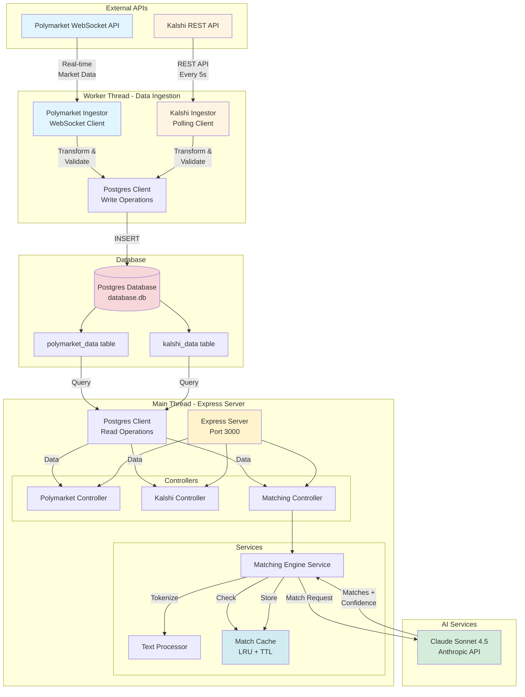
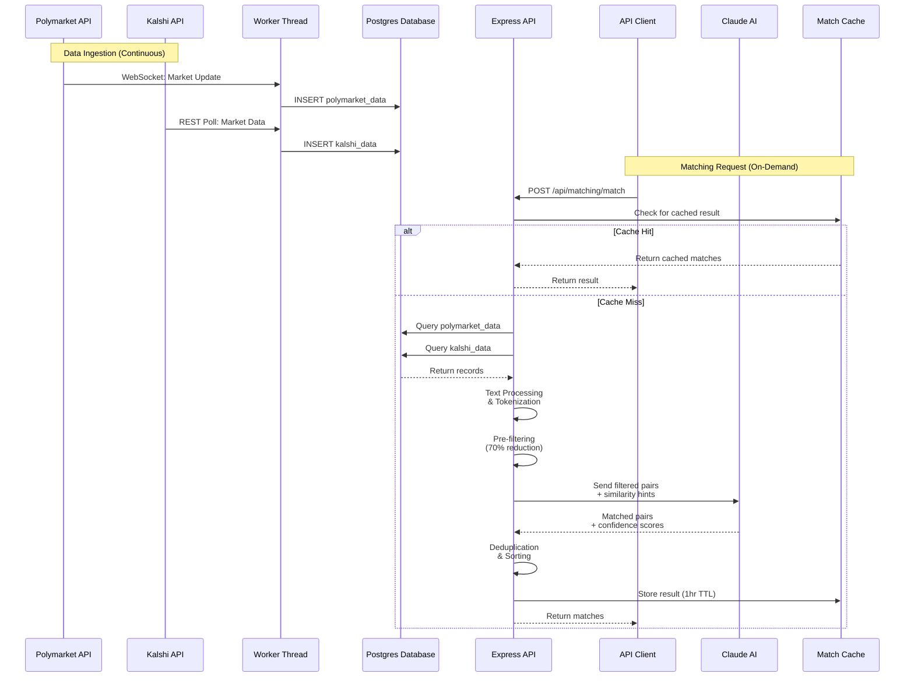
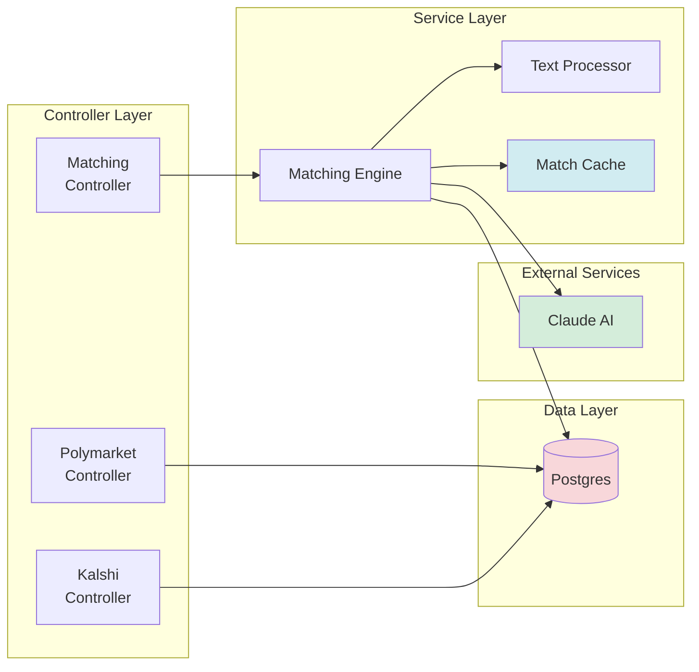
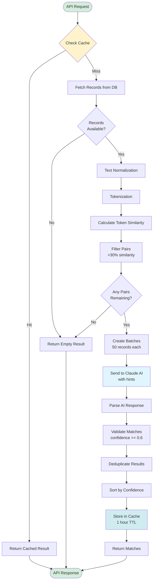
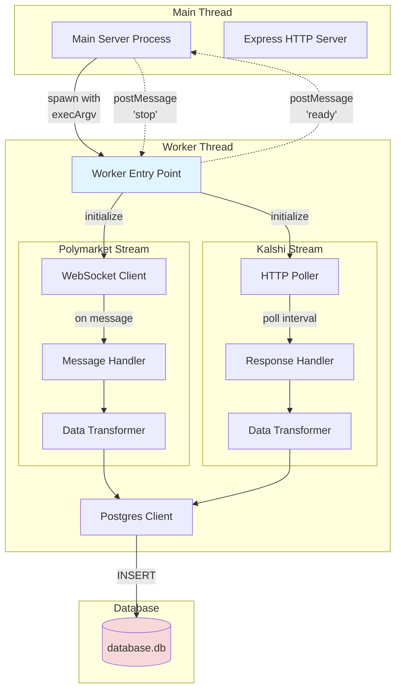
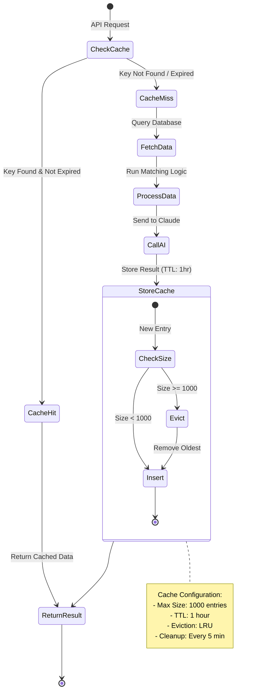
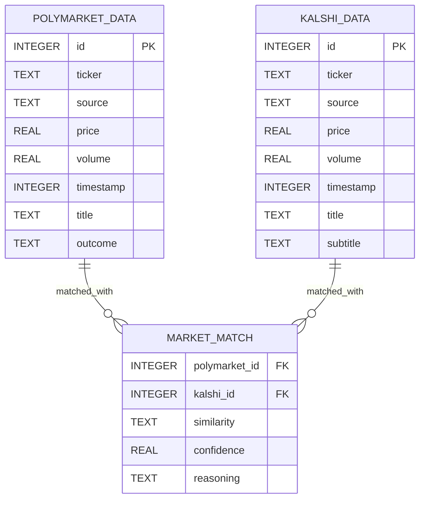
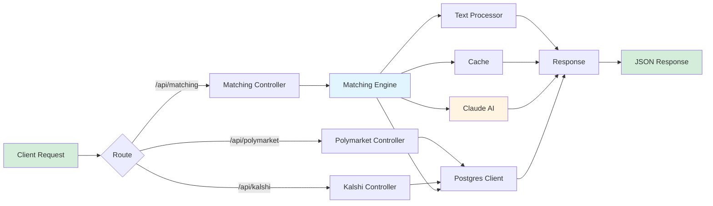

# Architecture Diagrams

## System Architecture Diagram

## Data Flow Diagram

## Component Interaction Diagram

## Matching Engine Flow

## Worker Thread Architecture

## Cache Strategy Diagram

## Database Schema

## Request Processing Pipeline

